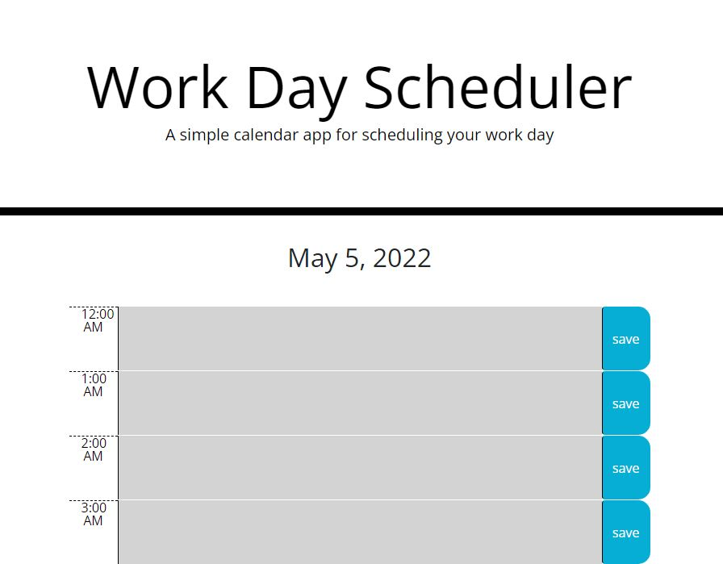
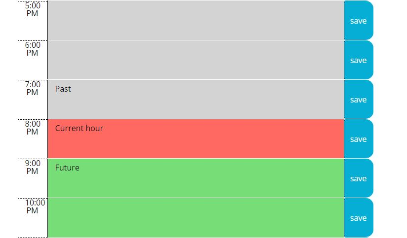

# Work Day Scheduler Readme
## Description
This repository contains code for my Work Day Scheduler assignment for my coding bootcamp. It is a webpage that lets the user input and save data into a list sorted by hour. It uses the luxon api to display the current date and format the hour labels for each row.
## Links
GitHub Repo: https://github.com/Jacee94/work-day-scheduler  
Deployed URL: https://jacee94.github.io/work-day-scheduler/  
Luxon API: https://moment.github.io/luxon/#/  
## Screenshots
  

